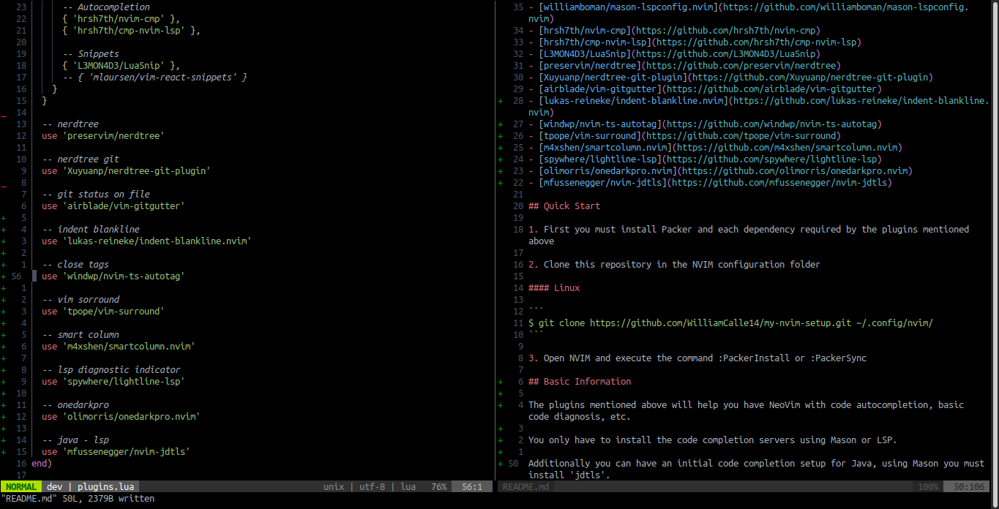
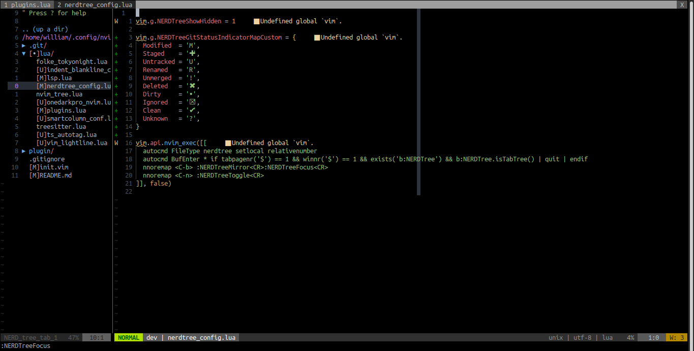
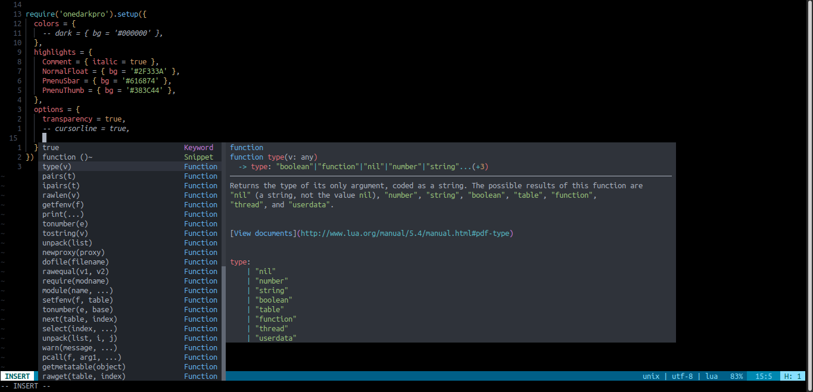

# Simple

Highlights: Get auto-completion for most programming languages using lsp-zero, mason and other plugins

## Plugins used:

- [wbthomason/packer.nvim](https://github.com/wbthomason/packer.nvim)
- [jiangmiao/auto-pairs](https://github.com/jiangmiao/auto-pairs)
- [itchyny/lightline.vim](https://github.com/itchyny/lightline.vim)
- [itchyny/vim-gitbranch](https://github.com/itchyny/vim-gitbranch)
- [nvim-treesitter/nvim-treesitter](https://github.com/nvim-treesitter/nvim-treesitter)
- [VonHeikemen/lsp-zero.nvim](https://github.com/VonHeikemen/lsp-zero.nvim)
- [neovim/nvim-lspconfig](https://github.com/neovim/nvim-lspconfig)
- [williamboman/mason.nvim](https://github.com/williamboman/mason.nvim)
- [williamboman/mason-lspconfig.nvim](https://github.com/williamboman/mason-lspconfig.nvim)
- [hrsh7th/nvim-cmp](https://github.com/hrsh7th/nvim-cmp)
- [hrsh7th/cmp-nvim-lsp](https://github.com/hrsh7th/cmp-nvim-lsp)
- [L3MON4D3/LuaSnip](https://github.com/L3MON4D3/LuaSnip)
- [preservim/nerdtree](https://github.com/preservim/nerdtree)
- [Xuyuanp/nerdtree-git-plugin](https://github.com/Xuyuanp/nerdtree-git-plugin)
- [airblade/vim-gitgutter](https://github.com/airblade/vim-gitgutter)
- [lukas-reineke/indent-blankline.nvim](https://github.com/lukas-reineke/indent-blankline.nvim)
- [windwp/nvim-ts-autotag](https://github.com/windwp/nvim-ts-autotag)
- [tpope/vim-surround](https://github.com/tpope/vim-surround)
- [m4xshen/smartcolumn.nvim](https://github.com/m4xshen/smartcolumn.nvim)
- [spywhere/lightline-lsp](https://github.com/spywhere/lightline-lsp)
- [olimorris/onedarkpro.nvim](https://github.com/olimorris/onedarkpro.nvim)
- [mfussenegger/nvim-jdtls](https://github.com/mfussenegger/nvim-jdtls)

## Quick Start

1. First you must install Packer and each dependency required by the plugins mentioned above

2. Clone this repository in the NVIM configuration folder

#### Linux

```
$ git clone https://github.com/WilliamCalle14/my-nvim-setup.git ~/.config/nvim/
```

3. Open NVIM and execute the command :PackerInstall or :PackerSync

## Basic Information

The plugins mentioned above will help you have NeoVim with code autocompletion, basic code diagnosis, etc.

You only have to install the code completion servers using Mason or LSP.

Additionally you can have an initial code completion setup for Java, using Mason you must install 'jdtls'.

## Screenshots






